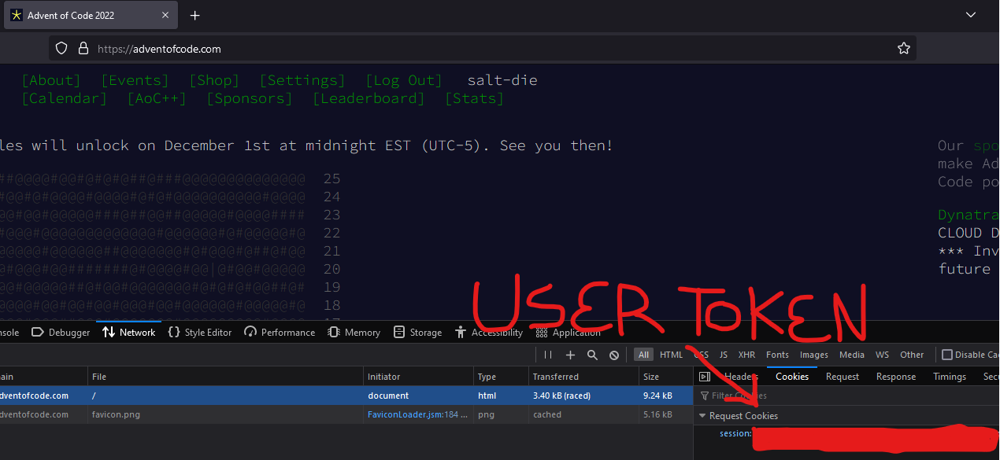

# aoc_lube - Proper Advent of Code lubricant.

Setting up aoc_lube
---------------------
* Save your user token to `~/.aoc_lube/.token`.
* [Optional] Create a new directory for your solutions. In this directory, run `aoc_lube.setup_dir`.

Getting your user token
-----------------------
* Navigate to https://adventofcode.com/. Make sure you are logged in.
* Right-click the page and click `Inspect`.
* Click on the `Network` tab.
* Reload the page.
* The token will be the session cookie in the request header to the page. It's a long hex string.

